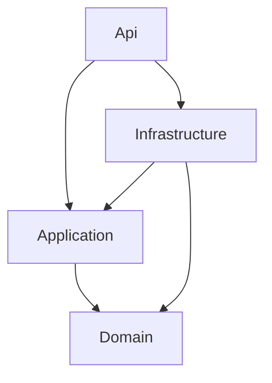

# Forge CLI

[](https://dotnet.microsoft.com/)
[](LICENSE)

Scaffold Clean Architecture ASP.NET Core Web APIs from the terminal.

Forge generates the solution, the layered projects, and the per-entity boilerplate (entity, EF Core configuration, DTO, service interface, controller) so you can start on business logic immediately.

<!-- TODO: add a terminal GIF here (e.g. recorded with VHS or asciinema). A 10-second demo of `forge` -> Add New Entity -> Subscription does more than any paragraph. -->

## Contents

- [Requirements](#requirements)
- [Installation](#installation)
- [Quick start](#quick-start)
- [What gets generated](#what-gets-generated)
- [Architecture](#architecture)
- [Scope and limitations](#scope-and-limitations)
- [Contributing](#contributing)
- [License](#license)

## Requirements

- [.NET 9 SDK](https://dotnet.microsoft.com/download/dotnet/9.0)

## Installation

Forge is currently installed from source.

```bash
git clone https://github.com/Ommmarr111/Forge-CLI.git
cd Forge-CLI
dotnet pack -c Release
dotnet tool install --global --add-source ./nupkg ForgeCli
```

Verify:

```bash
forge
```

Update or uninstall:

```bash
dotnet tool update --global --add-source ./nupkg ForgeCli
dotnet tool uninstall --global ForgeCli
```

## Quick start

### Create a solution

Run `forge` and choose **Create New Web API Solution**, then enter a name:

```text
? Solution name: GymManagement
```

Result:

```text
GymManagement/
├── GymManagement.Domain/
├── GymManagement.Application/
├── GymManagement.Infrastructure/
├── GymManagement.Api/
└── GymManagement.sln
```

### Add an entity

From the solution root:

```bash
cd GymManagement
forge
```

Choose **Add New Entity (Scaffold)**, enter a name, and select the components you want:

```text
? Entity name: Subscription
? Select components:
 ◉ Domain Entity
 ◉ EF Core Configuration
 ◉ DTO
 ◉ Service Interface
 ◉ API Controller
```

Forge reads your existing solution name and applies the matching namespaces.

## What gets generated

| Component | Project | Output |
| --- | --- | --- |
| Domain Entity | `*.Domain` | `Entities/Subscription.cs` |
| EF Core Configuration | `*.Infrastructure` | `Configurations/SubscriptionConfiguration.cs` (`IEntityTypeConfiguration<T>`) |
| DTO | `*.Application` | `DTOs/SubscriptionDto.cs` (record) |
| Service Interface | `*.Application` | `Interfaces/ISubscriptionService.cs` |
| API Controller | `*.Api` | `Controllers/SubscriptionsController.cs` |

Each component is optional.

### Example output

<!-- TODO: replace with the REAL generated code. Readers want to see exactly what they get. -->

```csharp
// GymManagement.Domain/Entities/Subscription.cs
namespace GymManagement.Domain.Entities;

public class Subscription
{
    // paste actual generated output here
}
```

## Architecture



<!-- TODO: verify these arrows against the .csproj references Forge actually generates. -->

| Layer | Responsibility |
| --- | --- |
| Domain | Entities and core business models |
| Application | DTOs and service abstractions |
| Infrastructure | EF Core persistence configuration |
| Api | HTTP endpoints and controllers |

## Scope and limitations

Forge generates structure, not behavior. It does not write:

- Business rules, validation, or authorization
- Entity relationships
- Service implementations

<!-- TODO: state explicitly whether Forge registers services in DI, adds DbSet<T> to your DbContext, or creates migrations. If it doesn't, say so here. -->

The CLI is currently interactive only.

## Contributing

Issues and pull requests are welcome. Before opening a PR, please:

1. Follow the existing project structure and generated-code conventions.
2. Add tests where applicable.
3. Keep the CLI experience consistent.

## License

Released under the [MIT License](LICENSE).
